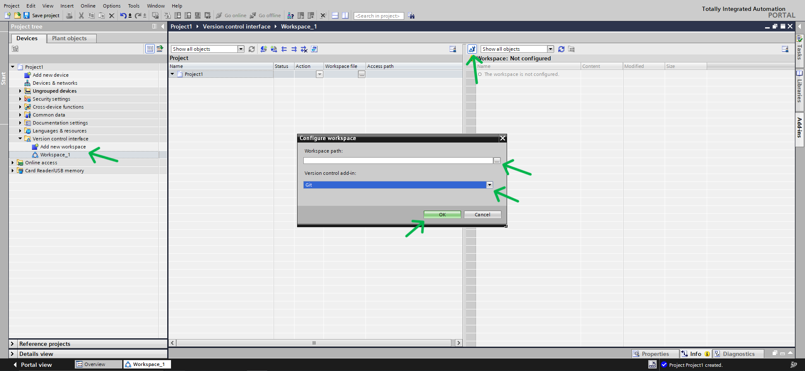
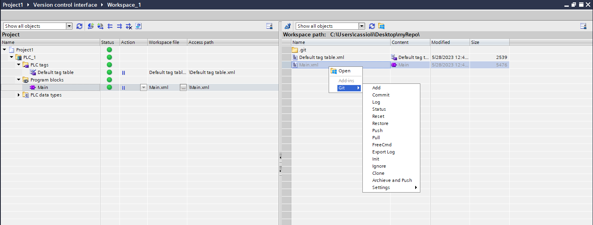

# TIA_Add-In_VCI_Git_Connector
>This TIA Add-In allows you to connect your VCI workspace at TIA Portal to a Git repository

---
## Summary
1. [About this Project](#1)
      * 1.1 [Requirements](#1_1)
      * 1.2 [Supporting Documentations](#1_2)
2. [How to Use (Installation)](#2)
      * 2.1 [Installation Requirements](#2_1)
      * 2.2 [Add-In Download](#2_2)
      * 2.3 [Save .addin File to Correct Location](#2_3)
      * 2.4 [Activation](#2_4)
      * 2.5 [Configuring the Workspace](#2_5)
      * 2.6 [Using VCI and Git](#2_6)
3. [Functions Documentation](#3)
      * 3.1 [Add](#3_1)
      * 3.2 [Commit](#3_2)
      * 3.3 [Log](#3_3)
      * 3.4 [Status](#3_4)
      * 3.5 [Reset](#3_5)
      * 3.6 [Restore](#3_6)
      * 3.7 [Push](#3_7)
      * 3.8 [Pull](#3_8)
      * 3.9 [Free Command](#3_9)
      * 3.10 [Export Log](#3_10)
      * 3.11 [Init](#3_11)
      * 3.12 [Ignore](#3_12)
      * 3.13 [Clone](#3_13)
      * 3.14 [Archieve and Push](#3_14)
      * 3.15 [Add/Set Origin](#3_15)
      * 3.16 [Settings](#3_16)

---
## <a name="1"></a> 1. About this Project
This is a TIA Add-In, what is a way to embed functions to your TIA Portal. No additional external applications are required to run TIA Add-Ins (See how to use it [here](#About)).

This project is based on a *Siemens AG - SIMATIC Systems Support project:* ***109773999_TIA_Add-In_VCI_Git_Connector_1.0.0_CODE***, to witch functions were added and modified.

With this Add-In you can connect the *Version Control Interface* of TIA with a git repository and then use all git's power on your project.

### <a name="1_1"></a>1.1 Requirements
* Basic knowledge on Git
* Basic knowledge on TIA

### <a name="1_2"></a>1.2 Supporting Documentations
* [VCI Documentation | Using TIA Portal Version Control Interface](https://support.industry.siemens.com/cs/mdm/109773506?c=129126268427&lc=en-BR)
* [Git Documentation](https://git-scm.com/)
* [Add-In Documentation | Extending TIA Portal functions with add-ins](https://support.industry.siemens.com/cs/mdm/109773506?c=128474251915&lc=en-BR)

---
## <a name="2"></a> 2. How to Use (Installation)
Follow the steps below

### <a name="2_1"></a>2.1 Installation Requirements
* TIA V16, V17 or V18 installed - [V18 TRIAL Download](https://support.industry.siemens.com/cs/document/109807109/simatic-step-7-incl-safety-s7-plcsim-and-wincc-v18-trial-download?dti=0&lc=en-WW)
* Git installed - [Latest source Release Download](https://git-scm.com/downloads)

### <a name="2_2"></a>2.2 Add-In Download
* Version 1.0.0 - [VCIGitConnector.addin](https://github.com/IgorCoraine/TIA_Add-In_VCI_Git_Connector/blob/master/VCI%20Git%20Connector/bin/Debug/Siemens.VCIGitConnector.addin)

### <a name="2_3"></a>2.3 Save .addin File to Correct Location
No installation is required to run the Add-In. You just have to **copy the .addin file downloaded above to your AddIns folder**.

The AddIns folder is finded inside your TIA Portal Installation directory. The standard location is 
<br>`C:\Program Files\Siemens\Automation\Portal V17\AddIns`

*When you paste it you will be asked to administrator permission, you just have to confirm if you are already logged as windows administrator.*

### <a name="2_4"></a>2.4 Activation
After coping the file, open your TIA Portal and open the *project view*. On the right of the screen open the *Add-ins* tab, select VCIGitConnector.addin and change the status to *Activate*. You will be asked to apply permissions, click *Yes* to Activate the Add-In.


### <a name="2_5"></a>2.5 Configuring the Workspace
If you followed the steps above, your Add-In is active on your TIA Portal, independently from the TIA project.

To use git on your project, create a *VCI workspace*, configure the repository folder, and select Git as the *Version control add-in*.



### <a name="2_6"></a>2.6 Using VCI and Git

#### 2.6.1 VCI
To add files from your project to your VCI repository or from your repository to your project, simply drag and drop the files or folders.

To check what can be used with VCI check the specific documentation at item *1.2 Supporting Documentations*.

#### 2.6.2 Git
The Git is going to work at the VCI repository making it a Git repository as well. **To use any functions you must have at least one file to the configured repository or drag and drop something from the project to the repository**.

To use the functions right click any of the files or folders at the repository side and choose the command you want, you can select more than one object to apply the command. Check the functions at next item *3. Functions Documentation*. To learn more about git check the specific documentation at item *1.2 Supporting Documentations*.



---
## <a name="3"></a> 3. Functions Documentation
The commands may differ a little bit from original terminal commands, for example combining more than one command, therefore is recommended to read the documentation before use.

Git commands will not be explained on this documentations. To learn more about Git commands refer to item *1.2 Supporting Documentations*.

### <a name="3_1"></a>3.1 Add

>Adds the selected objects
```shell
git add 'selected objects'
```
>Returns succesfull or error message on a pop-up

### <a name="3_2"></a>3.2 Commit

>Commits the selected objects
```shell
git commit 'selected objects' -m "given message"
```
>A commit message will be requested on a pop-up<br>
>Returns succesfull or error message on a pop-up

### <a name="3_3"></a>3.3 Log

>Shows resumed log
```shell
git log --oneline
```
>Returns the log or error message on a pop-up

### <a name="3_4"></a>3.4 Status

>Shows repository status
```shell
git status
```
>Returns the status or error message on a pop-up

### <a name="3_5"></a>3.5 Reset

>Resets the selected objects
```shell
git reset HEAD 'selected objects'
```
>Returns succesfull or error message on a pop-up

### <a name="3_6"></a>3.6 Restore

>Restores the selected objects
```shell
git restore 'selected objects'
```
>A confirmation will be requested on a pop-up<br>
>Returns succesfull or error message on a pop-up

### <a name="3_7"></a>3.7 Push

>Pushes the repository
```shell
git push
```
>Returns succesfull or error message on a pop-up<br>
>**It is necessary to add remote origin first**

### <a name="3_8"></a>3.8 Pull

>Pulls the repository
```shell
git pull
```
>Returns succesfull or error message on a pop-up<br>
>**It is necessary to add remote origin first**

### <a name="3_9"></a>3.9 Free Command

>Allows you to execute any git command
>
> The command will be requested on a pop-up and must be written **without** the 'git'
```shell
git 'passed command'
```
>Returns succesfull or error message on a pop-up

### <a name="3_10"></a>3.10 Export Log

>Exports a html file with git's log
>
> If a file gitLog.html already exists, it will be overwritten
```shell
git log
```
>Returns succesfull or error message on a pop-up<br>
>Creates a gitLog.html file on the current directory

### <a name="3_11"></a>3.11 Init

>Initiates a git repository and configure the user
```shell
git init
git config user.name 'given name'
git config user.email 'given email'
```
>User name and email will be requested on a pop-up<br>
>Returns succesfull or error message on a pop-up

### <a name="3_12"></a>3.12 Ignore

>Ignores the selected files
>
> If the file .ignore doesn't exists, it will be created on the current directory<br>
> If the file .ignore exists, the file will be added to the end of it

### <a name="3_13"></a>3.13 Clone

>Clones a remote repository
```shell
git clone 'given url'
```
>The remote repository address will be requested on a pop-up<br>
>Returns succesfull or error message on a pop-up<br>

### <a name="3_14"></a>3.14 Archieve and Push

>Archieves the current project to the repository directory, add, commit and pushes the changes
```
project.save()
project.archieve()
```
```shell
git add .
git commit -m "Added archieved project"
git push
```

### <a name="3_15"></a>3.15 Add/Set Origin

>Adds remote Origin <br>
>Rr if Origin already exists, set-url for remote Origin

```shell
git remote add origin 'given url'
```
```shell
git remote set-url origin 'given url'
```
>The remote origin address will be requested on a pop-up<br>
>Returns succesfull or error message on a pop-up<br>

### <a name="3_16"></a>3.16 Settings

>Here you can setup some default configurations

#### 3.16.1 Commit on VCI synchronize

>Commits the added files to VCI automatically
```shell
git add .
git commit -m 'given message'
```
>A commit message will be requested on a pop-up<br>
>Returns succesfull or error message on a pop-up

#### 3.16.2 Push on VCI synchronize

>Commit and pushes the added files to VCI automatically
```shell
git add .
git commit -m 'given message'
git push
```
>A commit message will be requested on a pop-up<br>
>Returns succesfull or error message on a pop-up
>**It is necessary to add remote origin first**

---
